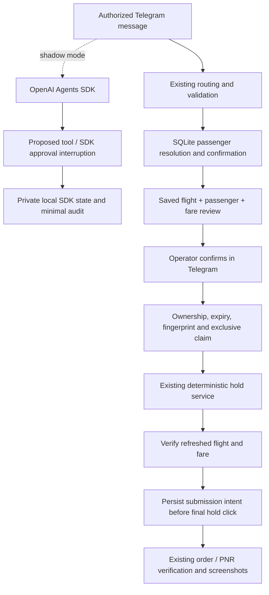

# Hybrid Agent migration — OpenAI Agents SDK

Decision: option **1A**, one manager agent using `@openai/agents`. The SDK owns model/tool iteration and interruption state. Application code owns permissions, validation, case transitions and browser actions. The existing SQLite passenger resolver and 1Booking services remain the execution boundaries.

## Implemented milestone

This change delivers Phase 0 (hold approval and duplicate protection), the
shadow foundation, and the deterministic search-snapshot contract for the
`hybrid_search` pilot. `AGENT_ORCHESTRATION_MODE=legacy` remains the default;
`shadow` observes SDK proposals without acting, while `hybrid_search` is the
search-only pilot route. Selection, passenger handling, and booking actions
remain application-owned and are outside the pilot tool catalog. Configure the
pilot with `OPENAI_MODEL=gpt-5.6-luna`.



### Hold approval

- `requireConfirmationBeforeHold` and `autoHoldBooking` are now enforced at the service boundary and every Telegram automatic-hold entry. Default settings require review. Automatic legacy holds require both `autoHoldBooking=true` and `requireConfirmationBeforeHold=false`; SDK modes always require review.
- Selecting or attaching a database passenger is a separate action from approving a hold. Existing name matching, candidate buttons, gender and DOB follow-ups remain in place.
- Approval is stored in the case, tied to its Telegram chat, with a random token, 15-minute expiry, deciding operator and SHA-256 fingerprint of the saved search, selected fare and passenger details. Only authenticated Telegram callbacks approve it; natural-language model output cannot approve anything.
- A repeated, expired, wrong-chat or changed-data callback cannot execute a hold. The service consumes approval before browser launch. Restart does not lose pending approval: the original button reads the saved case. `/hold BK-YYYYMMDD-HHMMSS` requests a fresh review for a ready case.
- The browser rereads the selected flight. A changed flight number, fare text or booking class stops the hold. The saved fingerprint and agent-enabled setting are checked again before submission. This compares the selected card's fare; it does not add a new review-drawer total-price parser.
- Each hold uses an exclusive `data/hold-claims/<caseId>.lock` file in addition to the existing process-wide browser lock. A second process cannot consume the same approval. A hard crash leaves the claim file behind and blocks retry pending operator review.
- `holdSubmittedAt` now conservatively means **the final hold click may have been submitted**: the marker is written immediately before the click. Click errors are treated as uncertain submissions. Existing success/PNR states are reused, never held again.
- If the agent crashes with a claim file, inspect the existing order first and use the existing `recover ... PNR ...` flow when applicable. Only remove that case's claim after confirming the external outcome. No automatic stale-lock expiry is allowed.
- New cases record `telegramChatId`. Historical cases without ownership remain readable/recoverable, but cannot acquire a new Telegram hold approval. Create a fresh request after checking the old booking outcome; do not infer ownership from a supplied case ID.

### SDK shadow mode

- Receives authorized non-command messages alongside legacy processing. It never sends Telegram messages or executes search, passenger or hold tools. Busy shadow chats skip another observation; legacy work continues.
- Tool availability comes from saved case state. Every proposed tool uses SDK `needsApproval: true`. Its executor also refuses execution if someone accidentally approves the paused shadow state.
- Instructions ask for criteria for “tốt nhất”, “giờ đẹp” and similar ambiguity; they do not introduce a deterministic `best` mapping. Supported proposals include clarification, case inspection, search, comparison, selection, passenger lookup and hold, depending on state.
- Search now retains the displayed structured candidates in the case. The model sees a bounded projection of case state, with no passenger profile, DOB, contact information, approval token or PNR.
- Raw operator messages are bounded and common email/phone/secret patterns are redacted. DOB-shaped dates are removed in a selected-flight context. Pattern redaction is not a general PII detector; operators must not include unrelated sensitive data in shadow messages.
- Runs use a 20-second abort signal, at most three model turns, and disabled SDK tracing. Errors are recorded without raw provider errors, and do not block or retry legacy actions.
- `data/agent-sessions` stores a small per-chat history and the latest opaque serialized paused SDK state, separate from minimal application logs. State may contain model continuation items; do not publish it as logs or screenshots. It is a private local diagnostic artifact, with one current snapshot per chat.
- Application logs record proposed tool names, model, token usage and latency. They exclude raw arguments, passenger records and reasoning. Inspect the private paused state for detailed shadow evaluation. This first evaluator observes the next proposal only; it does not execute tools to simulate later decisions, and shadow clarifications are never treated as questions actually shown to the operator.

### Hybrid search pilot

The pilot route is selected before hold recovery, `/hold` selection, passenger
parsing, and their callbacks. It requires the Telegram allowlist, enabled agent
settings, and `autoSearchFlights`; otherwise the existing route continues. A
chat-owned sequential queue and durable message IDs prevent duplicate work
across concurrent updates and process restarts.

The provider-facing `HybridSearchFlightRequestSchema` is a root object kept
separate from the legacy parser schema. The application validates routes,
catalog airlines, one-way support, dates, time bounds, and same-day cutoffs
before opening Playwright. The SDK can request clarification, inspect a case,
search flights, or compare a captured snapshot. It cannot select a flight,
resolve passengers, hold a booking, or call a browser action directly.

Each successful full search stores every observed candidate, including cards
excluded by the first filter, with snapshot-local candidate IDs and screenshot
batches. Cheapest ranking uses the lowest visible VND price and stable card
order for ties; candidates with no visible price are excluded from that ranking
and surface an explicit unrankable result. A no-match comparison keeps the
complete snapshot and asks before any relaxation. Same-route/date follow-ups
reuse the fresh snapshot without opening a browser; a route/date change or
explicit refresh starts a new timestamped search attempt. A failed refresh
leaves the previous snapshot available but never labels it as fresh.

Date and departure-time policy uses `Asia/Ho_Chi_Minh`. Yearless dates resolve
to the next valid occurrence, including February 29. Invalid and past dates
require clarification. Same-day searches require an explicit earliest time and
exclude departed flights on both initial and cached comparisons. Around-time
requests retain the clamped two-hour interval; exact, directional, and between
constraints retain both endpoints and their inclusivity.

## Run and verify

Use Node 24 and the repository's pinned pnpm version from the repository root:

```sh
pnpm install
pnpm build
pnpm test:hybrid-agent
pnpm test:hybrid-search
pnpm test:hybrid-search-browser
pnpm test:hybrid-search-agent
pnpm test:parser
pnpm test:passenger-parser
pnpm test:passengers
pnpm telegram:start
```

Keep `AGENT_ORCHESTRATION_MODE=legacy` for the existing workflow. To evaluate SDK proposals, set `AGENT_ORCHESTRATION_MODE=shadow` with `OPENAI_API_KEY` configured and restart the agent. To run the search-only pilot after the final integration checks, set `AGENT_ORCHESTRATION_MODE=hybrid_search` and `OPENAI_MODEL=gpt-5.6-luna`. Both modes send redacted operator text and bounded case data to OpenAI and consume API usage. Source and `.env` edits require a process restart.

`test:hybrid-agent` uses temporary storage, mocked Telegram and a deterministic model adapter with the real SDK runner. It verifies approval expiry/replay/ownership, changed fare/passenger fingerprints, consumption, exclusive/crash claims, redaction, isolated sessions and SDK interruption serialization/resume with a **fake** hold. These contracts do not prove model reasoning quality or a real Telegram/1Booking transaction.

`test:hybrid-search` covers the provider-compatible request schema, Vietnam date
and time policy, deterministic full-snapshot filtering, no-match behavior,
unrankable prices, screenshot mappings and verified IDs. The browser fixture
suite covers settled empty results, transient zero results, provider count
growth, and parser drift without contacting 1Booking. `test:hybrid-search-agent`
uses the real SDK runner with a deterministic model and fake automation; it
checks clarification persistence, cache reuse, refresh, replay and the
search-only tool boundary. `eval:hybrid-search` is opt-in and uses real OpenAI
model decisions with fake automation and isolated temporary state. It consumes
API usage but sends no Telegram messages and performs no booking action.

The production build compiles `src` and `scripts` to `dist`; run from the repository root so existing configuration, auth and data paths still resolve. Tests retain the existing `tsx` workflow. No real hold or ticket issuance is part of verification.

## Remaining migration stages

Verification on 2026-09-10: the production build, compiled module imports and all seven offline contract suites passed. The optional `pnpm eval:agent-shadow` command uses three fixed synthetic requests and consumes OpenAI API usage without executing any tool. Its live run was blocked by HTTP 429 (`You have no credits remaining`), so live model tool choices and schema acceptance remain unverified. Re-run it after restoring API credits. No Telegram messages, real holds or ticket issuance were performed during this implementation.

1. Shadow evaluation: replay representative sanitized conversation sequences; score tool and argument decisions, clarification quality, timeout behavior and cost. Decide acceptance thresholds from those results.
2. Search pilot completion: finish the SDK/Telegram adapter tests, real OpenAI multi-turn evaluation, and final rollout review for the search-only `hybrid_search` route. Keep deterministic snapshots and application validation as the trust boundary.
3. Selection and passengers: select only current stored candidates, revalidate live UI, preserve SQLite resolution and explicit ambiguous-candidate confirmation. Add passenger tool outcomes with minimal fields and persisted pending-candidate context.
4. SDK live hold: map SDK `needsApproval` interruptions to Telegram review; persist and resume the exact run using `RunState.fromString` and its **rehydrated** `getInterruptions()` items. Reuse the service-level fingerprint/claim checks. Gate rollout on restart, rejection, expiry, duplicate callback and fake-hold E2E tests, followed by separately authorized live QA.
5. Reduce legacy routing only after the pilot meets acceptance criteria. Keep deterministic schemas, ranking, browser services, screenshots and recovery.

The current Telegram approval path is application-owned for the legacy service. The SDK approval/resume mechanism is verified with test tools and shadow state; it is not yet wired to a live booking executor. Redis, multi-agent orchestration, direct model browser control and ticket issuance are outside this migration's initial scope.

## Official references

- [OpenAI Agents SDK quickstart](https://developers.openai.com/api/docs/guides/agents/quickstart)
- [Guardrails and human review](https://developers.openai.com/api/docs/guides/agents/guardrails-approvals)

Installed SDK declarations and offline runner tests are the implementation reference for serialization and approval details. Re-run them before changing SDK versions or resuming state written by a different version.
